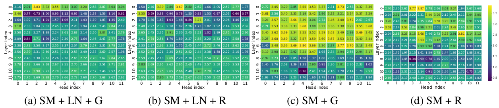

# ReLU's Revival: On the Entropic Overload in Normalization-Free Large Language Models

Welcome to the official repository for our paper, **"ReLU's Revival: On the Entropic Overload in Normalization-Free Large Language Models"**, accepted to the [ATTRIB@NeurIPS'24](https://attrib-workshop.cc/) workshop. Our paper is available on [arXiv](https://arxiv.org/abs/2410.09637).

## 📝 Abstract

LayerNorm is a critical component in modern large language models (LLMs) for stabilizing training and ensuring smooth optimization. However, it introduces significant challenges in mechanistic interpretability, outlier feature suppression, faithful signal propagation, and the computational and communication complexity of private inference. This work explores desirable activation functions in normalization-free decoder-only LLMs. Contrary to the conventional preference for GELU in transformer-based models, our empirical findings demonstrate an _opposite trend_—ReLU significantly outperforms GELU in LayerNorm-free models, leading to an **8.2%** perplexity improvement. 

We discover a key issue with GELU, where early layers experience entropic overload, resulting in the under-utilization of the representational capacity of attention heads. This highlights that smoother activations like GELU are _ill-suited_ for LayerNorm-free architectures, whereas ReLU's geometrical properties—specialization in input space and intra-class selectivity—lead to improved learning dynamics and better information retention in the absence of LayerNorm. This study offers key insights for optimizing transformer architectures where LayerNorm introduces significant challenges.

<p align="center">
     
     <br>
     <em>Attention head entropy heatmaps for baseline and normalization-free GPT-2 models with GELU and ReLU activations, highlighting entropic overload in early layers of GELU-based normalization-free model.</em>
</p>


## 📚 Overview

This repository contains the codebase and resources for exploring the entropic characteristics of normalization-free transformers, particularly focusing on the use of ReLU activation in large language models (LLMs). Our approach sheds light on the advantages of removing normalization layers for efficient model training and inference in transformer architectures, making this research particularly relevant for efficient private inference tasks.

## 🔧 Installation

To get started with the repository, clone the repository and install dependencies as follows:

```bash
git clone https://github.com/Nandan91/relu-revival-normfree
cd relu-revival-normfree
pip install -r requirements.txt
```
## 📂 Repository Structure

The repository is organized into directories to simplify exploration and usage:

```php
.
├── normfree_transformers/        # Core model and utility files
│   ├── config/                   # Configuration files for model and training
│   │   ├── config.yaml           # General configuration file
│   │   ├── model/
│   │   │   └── default.yaml      # Default model configuration
│   │   └── train/
│   │       └── train.yaml        # Training-specific configuration
│   ├── model_utils.py            # Model architecture utilities
│   └── train_utils.py            # Training utilities
├── scripts/
│   ├── experiments/              # Experimentation scripts for model training
│   │   ├── train_baseline.sh     # Script for training baseline model
│   │   └── train_normfree.sh     # Script for training normalization-free model
│   └── plotting/                 # Visualization and analysis scripts
│       ├── plot_headwise_entropy_heatmap.py # Head-wise entropy heatmap generator
│       ├── plot_layerwise_entropy.py        # Layer-wise entropy analysis plotter
│       └── plot_layerwise_nan_counts.py     # Tracks NaNs in layers for instability detection
├── requirements.txt              # Dependencies
└── run_clm.py                    # Main script for running LLM training

```

## 🔬 Project Components

### Model Architecture & Configuration
The `normfree_transformers/` directory contains:

- **Configuration files** in YAML format for easy adjustments to model and training parameters.
- **Model utilities** (`model_utils.py`): Contains modular functions to define the normalization-free architecture with desriable activation functions.
- **Training utilities** (`train_utils.py`): Helper functions for training the model with advanced monitoring and logging.

### Experimentation
Experiment scripts for training normalization-free and baseline models are available in `scripts/experiments/`:

- `train_baseline.sh`: Trains a standard transformer model.
- `train_normfree.sh`: Trains our novel normalization-free transformer model.

### Analysis & Visualization
The `scripts/plotting/` directory provides tools for analyzing entropy dynamics and training stability:

- `plot_headwise_entropy_heatmap.py`: Generates entropy visualizations across attention heads in a full-trained model.
- `plot_layerwise_entropy.py`: Performs layer-wise entropy analysis, helpful for observing entropic patterns during training.
- `plot_layerwise_nan_counts.py`: Identifies instability by tracking NaN counts in each layer during training.

  
## Usage 🚀
All models were trained and evaluated on [CodeParrot dataset](https://huggingface.co/learn/nlp-course/chapter7/6) (2.1B training tokens) using a single NVIDIA RTX 3090 GPU (24GB VRAM).
### Training a Model

To start training a normalization-free model:

```bash
bash scripts/experiments/train_normfree.sh
```

To train a baseline model:

```bash
bash scripts/experiments/train_baseline.sh
```
### Perplexity Evaluation 
> The baseline GPT-2 ($L$=12, $H$=12, $d$=768) with GELU and ReLU activations converge to evaluation loss of ≈`0.988` and ≈`1.014` respectively, after 32K training steps (device batch size = 128).

| Model | GPT-2 (T=128) | | Pythia-70M (T=128) | | Pythia-70M (T=256) | |
|:---:|:---:|:---:|:---:|:---:|:---:|:---:|
| | Eval PPL | +Δ(%) | Eval PPL | +Δ(%) | Eval PPL | +Δ(%) |
| SM+LN+G | 2.688 | 0.00 | 3.512 | 0.00 | 3.054 | 0.00 |
| SM+LN+R | 2.757 | 2.53 | 3.590 | 2.22 | 3.107 | 1.73 |
| SM+G | 3.197 | 18.92 | 4.086 | 16.35 | 3.570 | 16.87 |
| SM+R | 2.936 | 9.20 | 3.736 | 6.36 | 3.273 | 7.17 |

*Evaluation Perplexity (PPL) and Relative Change (+Δ%) for GPT-2 and Pythia-70M models across different configurations. Normalization-free model with ReLU activations outperform their GELU counterpart.*


### Visualization

To analyze entropic characteristics, generate entropy heatmaps or layer-wise plots using the `scripts/plotting/` tools.

## 📑 Citation

If you find our work valuable for your research, please consider citing us:

```bibtex
@article{jha2024relusrevival,
       title={ReLU's Revival: On the Entropic Overload in Normalization-Free Large Language Models},
       author={Jha, Nandan Kumar and Reagen, Brandon},
       journal={2nd Workshop on Attributing Model Behavior at Scale (NeurIPS)},
       year={2024}
}
```
## Contact 📧

For any inquiries or further information, feel free to reach out to the primary author:

* Nandan Kumar Jha: [nj2049@nyu.edu](mailto:nj2049@nyu.edu)

## Acknowledgments

This code is built on the [Simplified Transformers](https://github.com/bobby-he/simplified_transformers).
